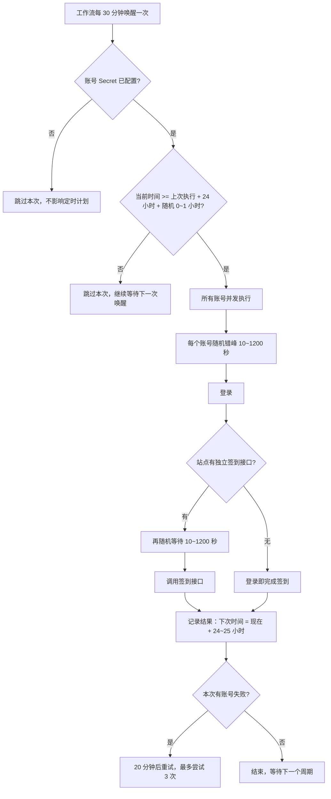

# 自动签到（GitHub Actions）

基于 GitHub Actions 的多账号自动签到，支持两个站点，各自独立地按 **24~25 小时的随机间隔** 执行：

- **站点一**（`checkin.mjs`）：登录 → 随机等待 → 调用签到接口
- **站点二**（`checkin2.mjs`）：登录即签到（站点没有独立的签到接口，登录成功后流程结束）

账号密码保存在仓库 Secret 中；每个账号先 **随机错峰 10~1200 秒** 再登录（站点一登录成功后还会再 **随机等待 10~1200 秒** 才签到）；多个账号 **并发** 执行，互不影响，也不会在同一时刻集中登录。只用一个站点也没问题：未配置账号的那个工作流会自动跳过。

## 目录结构

| 文件 | 作用 |
| --- | --- |
| `.github/workflows/checkin.yml` | 站点一的工作流：定时唤醒 + 手动触发 |
| `.github/workflows/checkin2.yml` | 站点二的工作流：定时唤醒 + 手动触发 |
| `checkin.mjs` | 站点一入口：登录 → 随机等待 → 签到接口 |
| `checkin2.mjs` | 站点二入口：登录即签到 |
| `checkin-core.mjs` | 公共逻辑：账号解析、并发控制、随机等待、登录、日志脱敏 |
| `schedule.mjs` | 调度状态：判断是否到达执行时间、计算下一次执行时间 |

## 两个站点的差别

| | 站点一 | 站点二 |
| --- | --- | --- |
| 签到方式 | 登录后调用 `/api/user/checkin` | 登录本身即签到，无额外请求 |
| 登录后随机等待 | 有（10~1200 秒） | 无（没有后续请求可等） |
| 账号 Secret | `CHECKIN_ACCOUNTS` | `CHECKIN2_ACCOUNTS` |
| Variables 前缀 | `CHECKIN_*` | `CHECKIN2_*` |
| 工作流名称 | 自动签到 | 自动签到 2 |
| 工作流超时 | 90 分钟 | 45 分钟 |

## 执行流程



1. GitHub 的定时任务只能按固定 cron 触发、无法随机，所以工作流每 30 分钟唤醒一次，由 `schedule.mjs due` 读取缓存中的状态判断：没到时间就直接结束，不做任何登录/签到请求。
2. 到时间后脚本并发处理所有账号。每个账号独立执行：先随机错峰等待 **10~1200 秒** → 登录 →（站点一）再随机等待 **10~1200 秒** → 签到；单个账号出错不影响其他账号。
3. 执行完把「下一次执行时间」写回缓存：**现在 + 24 小时 + 随机 0~3600 秒**（即 24~25 小时）。两个站点的状态存在各自独立的缓存里，互不影响。
4. 失败时 20 分钟后重试；连续失败 3 次后放弃本周期，回到 24~25 小时的正常节奏（即一个周期最多尝试 3 次）。

## 使用步骤

### 1. 把仓库推送到 GitHub

工作流必须在默认分支上，定时任务（schedule）才会生效。仓库名、描述、提交信息建议也不要出现站点字样。

### 2. 配置账号密码 Secret

打开仓库 **Settings → Secrets and variables → Actions → Secrets → New repository secret**，按需配置（两个站点也可以只用一个）：

| Secret 名称 | 用途 |
| --- | --- |
| `CHECKIN_ACCOUNTS` | 站点一的账号，每行一个 |
| `CHECKIN2_ACCOUNTS` | 站点二的账号，每行一个 |

**Secret 内容**：每行一个账号，格式 `用户名:密码`，`#` 开头的行会被忽略（邮箱形式的用户名也可以直接写）：

```text
alice:my-password-1
bob:my-password-2
foo@example.com:my-password-3
```

也支持 JSON 数组格式（属性名必须是 `username` / `password`）：

```json
[
  { "username": "alice", "password": "my-password-1" },
  { "username": "bob", "password": "my-password-2" }
]
```

说明：用户名与密码的分隔符是**第一个冒号或空白字符**，因此密码里可以包含冒号和空格；不支持包含换行的密码。

### 3. 启用 Actions 并手动测试

1. 打开仓库 **Actions** 标签页，如果提示工作流被禁用，点击 **Enable workflow**。
2. 左侧选择「**自动签到**」或「**自动签到 2**」→ 右侧 **Run workflow**。
3. `force` 默认勾选，表示立即执行一次（忽略 24~25 小时间隔），适合验证配置是否正确。
4. 展开运行日志，确认每个账号都显示成功；同时看一眼 Actions 页面顶部的运行时长（等待时间最长约 20 分钟属于正常）。

### 4. 完成

之后无需任何操作，两个工作流会各自按 24~25 小时的随机间隔执行，运行记录都在 Actions 标签页。

## 可选配置（Variables）

在 **Settings → Secrets and variables → Actions → Variables** 中添加，全部可省略。

**站点一（`CHECKIN_*`）**：

| 变量名 | 默认值 | 说明 |
| --- | --- | --- |
| `CHECKIN_BASE_URL` | 内置默认地址 | 站点地址，一般不用改 |
| `CHECKIN_LOGIN_STAGGER_MIN` | `10` | **登录前**随机错峰等待的最小秒数 |
| `CHECKIN_LOGIN_STAGGER_MAX` | `1200` | **登录前**随机错峰等待的最大秒数 |
| `CHECKIN_LOGIN_DELAY_MIN` | `10` | 登录成功后随机等待的最小秒数 |
| `CHECKIN_LOGIN_DELAY_MAX` | `1200` | 登录成功后随机等待的最大秒数 |
| `CHECKIN_CONCURRENCY` | `0` | 并发执行的账号数上限，`0` 表示全部并发 |

注意：`CHECKIN_LOGIN_STAGGER_MAX` 与 `CHECKIN_LOGIN_DELAY_MAX` 之和要小于工作流的 `timeout-minutes`（默认 90 分钟），否则任务会被超时中断。

**站点二（`CHECKIN2_*`）**：

| 变量名 | 默认值 | 说明 |
| --- | --- | --- |
| `CHECKIN2_BASE_URL` | 内置默认地址 | 站点地址，一般不用改 |
| `CHECKIN2_LOGIN_STAGGER_MIN` | `10` | **登录前**随机错峰等待的最小秒数 |
| `CHECKIN2_LOGIN_STAGGER_MAX` | `1200` | **登录前**随机错峰等待的最大秒数 |
| `CHECKIN2_CONCURRENCY` | `0` | 并发执行的账号数上限，`0` 表示全部并发 |

站点二没有「登录后等待」配置：登录本身就是签到，没有后续请求可等。

## 关于「24~25 小时」和随机性

- 每次执行成功后，下一次时间 = 本次执行时间 + 24 小时 + 随机 0~3600 秒，避免每天在完全相同的时刻签到；两个站点各自的计时互相独立。
- 每个账号的登录同样带随机错峰：登录前等待一个独立的随机时长（默认 10~1200 秒），因此多个账号不会在同一时刻集中登录。各账号的随机值互相独立，理论上仍有极小概率靠得很近。
- 单个账号最坏耗时 ≈ 错峰上限 + 登录后等待上限（站点一默认约 40 分钟；站点二只有错峰，约 20 分钟），仍在工作流超时时间内。
- GitHub 的定时任务本身可能延迟几分钟到几十分钟（高峰时段更明显），所以两次签到的真实间隔通常是 **24~25.5 小时**；这是平台限制，不是脚本问题。
- 手动触发（`force` 勾选）不受间隔限制，随时可以执行。
- 首次运行、或 Actions 缓存被清理后，会立即执行一次，然后重新开始计时。
- 想要更精确的落点，可以把对应工作流的 cron 改为 `*/15 * * * *`（每 15 分钟唤醒），代价是运行次数翻倍。

## 常见问题

**Q：日志里会不会泄露密码？**
不会。脚本会先把账号、密码注册为 GitHub 敏感信息（`::add-mask::`），日志中的用户名也做了脱敏（如 `al***ce`）。

**Q：Secret 没配置或配错名字会怎样？**
工作流在「检查账号配置与执行时间」步骤检测不到对应 Secret 时会提示并跳过本次，不会失败、也不占用定时计划；配置好之后自动启用。脚本层面在 CI 中缺少账号变量也会立即报错退出，不会卡住等待输入。

**Q：两个站点只用一个可以吗？**
可以。只配一个 Secret 即可，另一个工作流每次触发都会快速跳过（约几秒），不会产生失败记录。

**Q：私有仓库会消耗 Actions 分钟数吗？**
会。每次触发至少按 1 分钟计费，每 30 分钟唤醒一次约等于每天 48 分钟/工作流。公开仓库免费且不限量。

**Q：定时任务突然不跑了？**
公开仓库连续 60 天没有任何仓库活动（提交等）时，GitHub 会自动停用定时任务。到 Actions 页面点击 **Enable workflow** 重新启用即可；保持仓库偶尔有提交可以避免被停用。

**Q：怎么本地测试？**

```bash
# 站点一：登录 -> 随机等待 -> 签到（两个等待都设为 0 可立刻完成）
CHECKIN_ACCOUNTS='alice:my-password' CHECKIN_LOGIN_STAGGER_MIN=0 CHECKIN_LOGIN_STAGGER_MAX=0 CHECKIN_LOGIN_DELAY_MIN=0 CHECKIN_LOGIN_DELAY_MAX=0 node checkin.mjs

# 站点二：登录即签到（只有一个随机等待）
CHECKIN2_ACCOUNTS='foo@example.com:my-password' CHECKIN2_LOGIN_STAGGER_MIN=0 CHECKIN2_LOGIN_STAGGER_MAX=0 node checkin2.mjs

# 交互模式：按提示输入账号密码（站点一 / 站点二）
node checkin.mjs
node checkin2.mjs
```

需要 Node.js 18 或更高版本（脚本使用内置的 `fetch`）。

**Q：想修改间隔、重试次数？**
改 `schedule.mjs` 顶部的常量：`DAY_SECONDS`（基础间隔）、`MAX_EXTRA_SECONDS`（额外随机上限）、`RETRY_SECONDS`（失败重试间隔）、`MAX_FAILS`（一个周期最多尝试次数），两个站点同时生效。

**Q：想换签到站点？**
不用改代码：站点一配置 `CHECKIN_BASE_URL`，站点二配置 `CHECKIN2_BASE_URL`，即可覆盖内置默认地址。

**Q：某个账号密码填错了会怎样？**
该账号会失败，其他账号不受影响；工作流整体标记为失败，20 分钟后重试，一个周期最多尝试 3 次，随后等下一个周期。修正 Secret 后立即生效。

## 安全提示

- 账号密码只放在 Secret 里，不要写进代码、Issue 或提交历史。
- Secret 不会传递给来自 fork 的 Pull Request，也不会以明文出现在日志中。
- 自动化签到可能违反站点的服务条款，请自行评估风险。
